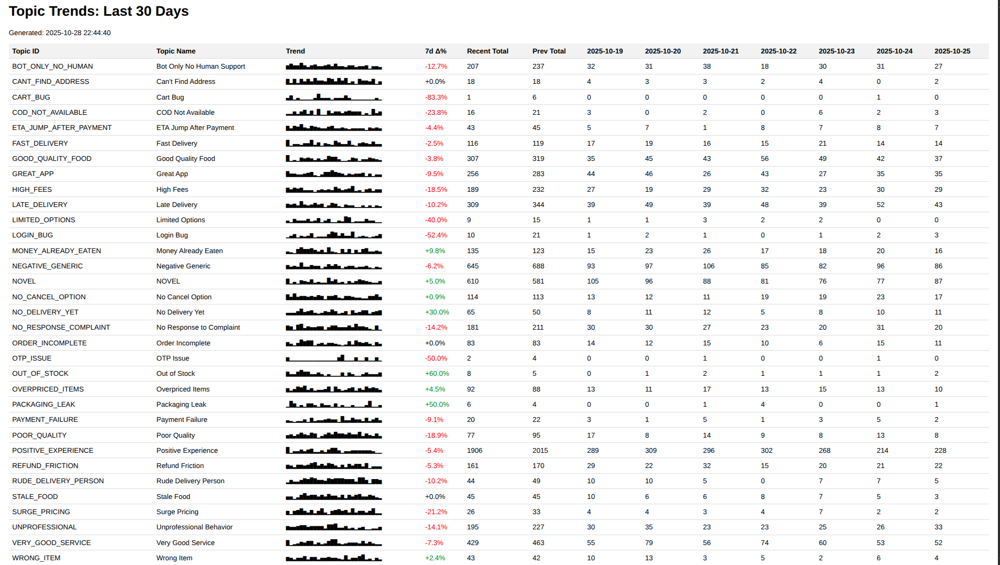

# AI Agent for Swiggy App Review Trend Analysis

This project builds an AI system that analyzes Google Play Store reviews for **Swiggy** (a popular food delivery app in India) and creates daily trend reports. The system automatically finds issues, requests, and feedback from thousands of reviews and tracks how they change over time.

## ⚠️ Important Disclaimer

**API KEY NOTICE:** The API keys used in this project's code are **REVOKED** and will not work. 

**You must use your own OpenAI API key to run this project.**

See the "Quick Start" section below for instructions on setting up your API key.

## 📋 What Was The Assignment?

**Task:** Build an AI agent that analyzes Google Play reviews and generates daily trend reports.

**Requirements:**
- Take reviews from June 2024 till date for **Swiggy app** (food delivery app)
- Process reviews in daily batches
- Track topics (issues, requests, feedback) over 30 days
- Create a trend report showing how topics change over time
- Use AI agents (not traditional topic modeling)
- Find new topics automatically
- Combine similar topics to avoid duplicates

**Output:** A table showing:
- Rows: Topics (like "Delivery issue", "Food stale", etc.)
- Columns: Dates from T-30 to T (last 30 days)
- Cells: How many times each topic appeared on each date

**Assignment Duration:** 24 hours

## ✅ What Did I Deliver?

I built a complete AI system with these features:

1. **Review Processing Pipeline** - Cleans and processes 264,000+ reviews
2. **AI Topic Detection** - Uses LLM (Large Language Model) to identify topics from reviews
3. **Novel Topic Discovery** - Automatically finds new topics not in the initial list
4. **Topic Deduplication** - Combines similar topics together (e.g., "Delivery guy was rude" + "Delivery partner behaved badly" → "Delivery partner rude")
5. **30-Day Trend Reports** - Shows how topics change over the last 30 days
6. **Daily Reports** - Generates CSV and HTML reports automatically

## 📊 Final Output

Here's what the trend report looks like:



*Note: Take a screenshot of your HTML report (`output/topics_trend_2025-10-28.html`) and save it as `output/topics_trend_screenshot.png`*

The report shows:
- **Topic names** (what people are complaining about or praising)
- **Sparklines** (mini charts showing trends)
- **7-day change** (how topics increased or decreased in the last week)
- **Daily counts** (exact numbers for each topic each day)

## 📹 Demonstration

**Video Walkthrough:** [Link to Video - Upload your video to Google Drive and add link here]

The video shows:
- How the system works step by step
- Running the complete pipeline
- Understanding the output reports
- How to interpret the trends

## 📄 Detailed Report

**PDF Report:** [Link to PDF - Upload your report and add link here]

The PDF includes:
- Technical architecture
- How the AI agents work
- Topic registry details
- Performance metrics
- Limitations and future work

## 🚀 Quick Start

### Setup

1. **Install Python packages**
   ```bash
   pip install -r requirements.txt
   ```

2. **Set YOUR API key** (⚠️ You must use your own API key)
   
   **Option A: Use OpenAI API**
   ```bash
   export OPENAI_API_KEY="sk-your-openai-key-here"
   ```
   
   **Option B: Use Megallm API**
   ```bash
   export MEGALLM_API_KEY="sk-mega-your-key-here"
   export MEGALLM_BASE_URL="https://ai.megallm.io/v1"
   ```
   
   **Note:** Get your API key from:
   - OpenAI: https://platform.openai.com/api-keys
   - Megallm: Their official website

3. **Run the pipeline**
   ```bash
   jupyter notebook notebooks/00_complete_pipeline.ipynb
   ```

That's it! The system will automatically:
- Load and clean the reviews
- Detect topics using AI
- Generate trend reports
- Save results to the `output/` folder

## 📁 Directory Structure

```
Assignment/
├── notebooks/                          # Main notebooks (for cloud API usage)
│   ├── 00_complete_pipeline.ipynb      # Runs entire pipeline
│   ├── 01_setup_and_clean.ipynb        # Data cleaning
│   ├── 02_topic_router.ipynb          # Topic detection
│   ├── 04_topic_canonicalization.ipynb # Merge similar topics
│   ├── 05_trend_analysis.ipynb        # Create reports
│   ├── cache.db                       # API response cache
│   └── utils/
│       └── llm_client.py              # LLM client
│
├── Notebook2/                         # Local LLM notebooks (Ollama)
│   ├── 00_complete_pipeline.ipynb
│   ├── 01_setup_and_clean.ipynb
│   ├── 02_topic_router.ipynb
│   ├── 04_topic_canonicalization.ipynb
│   ├── 05_trend_analysis.ipynb
│   ├── cache.db
│   └── utils/
│       └── llm_client.py
│
├── data/                              # Processed data
│   ├── reviews_clean.parquet          # Cleaned reviews
│   ├── labels_initial.parquet         # All topic labels
│   ├── novel_topic_summary.parquet    # New topics found
│   ├── daily_batches/                 # Daily review files
│   │   └── reviews_YYYY-MM-DD.parquet
│   └── daily_labels/                  # Daily label files
│       └── labels_YYYY-MM-DD.parquet
│
├── output/                            # Final reports
│   ├── topics_trend_2025-10-28.csv    # Trend data (CSV)
│   ├── topics_trend_2025-10-28.html   # Trend report (HTML)
│   └── topics_trend_2025-10-28_debug.csv
│
├── registry/
│   └── topic_registry.json            # Topic definitions (32 topics)
│
├── utils/                             # Shared utilities
│   └── llm_client.py
│
├── swiggy_scraped.csv                 # Raw review data
├── requirements.txt                   # Python dependencies
├── README.md                          # This file
└── venv/                              # Virtual environment
```

## 📝 Notebook Usage

**Use `notebooks/` folder** if you want to use cloud AI APIs (OpenAI, Megallm)
- Recommended for faster processing
- Requires API key and internet connection
- Costs money per API call

**Use `Notebook2/` folder** if you want to use local LLM (Ollama)
- Free (no API costs)
- Slower processing
- Needs Ollama installed locally
- Good for testing small samples

## 🔄 How It Works (Step by Step)

**Step 1: Load and Clean Data**
- Takes raw reviews from CSV file
- Removes bad data and cleans up text
- Saves cleaned data (225,000 valid reviews)

**Step 2: Find Topics**
- Uses AI to read each review
- Decides which topics match the review
- Each review can have multiple topics
- Saves results day by day

**Step 3: Combine Similar Topics**
- Looks for topics that mean the same thing
- Example: "Delivery guy was rude" and "Delivery person was impolite" → Same topic
- Saves a list of what topics to combine

**Step 4: Create Trend Report**
- Counts how many times each topic appeared each day
- Shows trends over 30 days
- Creates CSV and HTML reports

## 🎯 Topics Tracked

The system tracks 32 topics across 8 categories:

**Logistics** (6 topics):
- Order Incomplete
- ETA Jump After Payment
- Late Delivery
- Can't Find Address
- No Cancel Option
- No Delivery Yet

**Food** (4 topics):
- Stale Food
- Wrong Item
- Packaging Leak
- Poor Quality

**Pricing** (3 topics):
- High Fees
- Surge Pricing
- Overpriced Items

**Support** (3 topics):
- Bot Only No Human Support
- Refund Friction
- No Response to Complaint

**App/Payments** (6 topics):
- Payment Failure
- Login Bug
- Cart Bug
- OTP Issue
- COD Not Available
- Money Already Eaten

**Partner** (2 topics):
- Rude Delivery Person
- Unprofessional Behavior

**Merch** (2 topics):
- Out of Stock
- Limited Options

**Sentiment** (6 topics):
- Positive Experience
- Negative Generic
- Fast Delivery
- Good Quality Food
- Very Good Service
- Great App

## 💡 Key Features

✅ **AI-Powered Topic Detection** - Uses advanced AI to understand reviews  
✅ **Smart Topic Deduplication** - Combines similar topics automatically  
✅ **Novel Topic Discovery** - Finds new topics not in the initial list  
✅ **30-Day Trend Analysis** - Tracks changes over time  
✅ **Visual Reports** - HTML charts and CSV data  
✅ **Daily Processing** - Handles new reviews every day  
✅ **Efficient Caching** - Saves API costs with smart caching  

## 🔧 Technical Details

**Data Processing:**
- Tools: Polars (fast data processing), DuckDB (analytics)
- Format: Parquet files for efficient storage
- Cache: SQLite database for API responses

**AI System:**
- Provider: Megallm (OpenAI-compatible API)
- Model: GPT-4o-mini
- Features: JSON parsing, error handling, caching

**How Topics Are Found:**
1. System reads a review
2. Compares it to topic definitions in the registry
3. Decides which topics match
4. Can assign multiple topics to one review
5. Flags reviews that don't match any topic as "NOVEL"

**How Similar Topics Are Combined:**
1. Uses AI embeddings to understand topic meaning
2. Compares similarity scores
3. Combines topics with similarity > 82%
4. Uses AI to review uncertain cases

## 📊 Sample Output

**CSV Report** shows:
```csv
topic_id,2025-09-28,2025-09-29,...,2025-10-25,7d_change_pct
POSITIVE_EXPERIENCE,412,219,...,228,-5.41%
LATE_DELIVERY,60,55,...,43,-10.17%
MONEY_ALREADY_EATEN,17,15,...,16,9.76%
```

**HTML Report** shows:
- Visual sparklines (mini charts)
- Color-coded trends (green = increasing, red = decreasing)
- Sortable tables
- Interactive filters

## 📚 Requirements

Install these packages:
```
polars>=0.20.0          # Data processing
duckdb>=0.10.0          # Analytics
openai>=1.10.0          # AI API
sentence-transformers>=2.5.0  # Embeddings
jupyter>=1.1.0          # Notebooks
tqdm>=4.66.0            # Progress bars
```

Run: `pip install -r requirements.txt`

## 🐛 Troubleshooting

**API Key Issues (Most Common Problem):**
```bash
# Check if API key is set
echo $MEGALLM_API_KEY
echo $OPENAI_API_KEY

# IMPORTANT: Use YOUR own API key (the ones in the code are revoked)
# Set the API key
export OPENAI_API_KEY="sk-your-key-here"  # Get from https://platform.openai.com/api-keys
# OR
export MEGALLM_API_KEY="sk-mega-your-key-here"
```

**If you get "401 Unauthorized" or "Invalid API Key":**
- The API keys in the project code are revoked and won't work
- You MUST get your own API key
- See the "Quick Start" section for instructions

**Import Errors:**
```python
# In notebook, add this at the top
import sys
sys.path.append('../')
```

**Cache Issues:**
- Delete `notebooks/cache.db` if you get caching problems
- The cache helps save money by reusing API responses

## 🎓 Understanding The Results

**What to look for in the trend report:**

1. **Popular Topics** - Topics with high counts need attention
2. **Growing Trends** - Topics with green (positive) change percentages are increasing
3. **Improving Issues** - Topics with red (negative) change percentages are decreasing
4. **Novel Topics** - Watch the NOVEL topic to find new issues emerging

**Example:**
- "Late Delivery" with -10% means complaints about late delivery decreased by 10% in the last 7 days (good!)
- "Money Already Eaten" with +9.8% means this issue increased by 9.8% (needs attention!)

## 📝 Project Status

✅ **Complete and Working** - All notebooks executed successfully

**What's Been Done:**
- ✅ Data cleaning: 225,918 valid reviews processed
- ✅ Topic routing: All reviews labeled with topics
- ✅ Novel topic analysis: Summary generated
- ✅ Trend reports: Latest report created (2025-10-28)

**Generated Files:**
- ✅ `data/reviews_clean.parquet` - Cleaned reviews
- ✅ `data/labels_initial.parquet` - All topic assignments
- ✅ `data/novel_topic_summary.parquet` - New topics found
- ✅ `output/topics_trend_2025-10-28.csv` - Trend data
- ✅ `output/topics_trend_2025-10-28.html` - Visual report

## 📞 Contact

For questions about this project, contact: vatsal@pulsegen.io

## 📜 License

MIT
